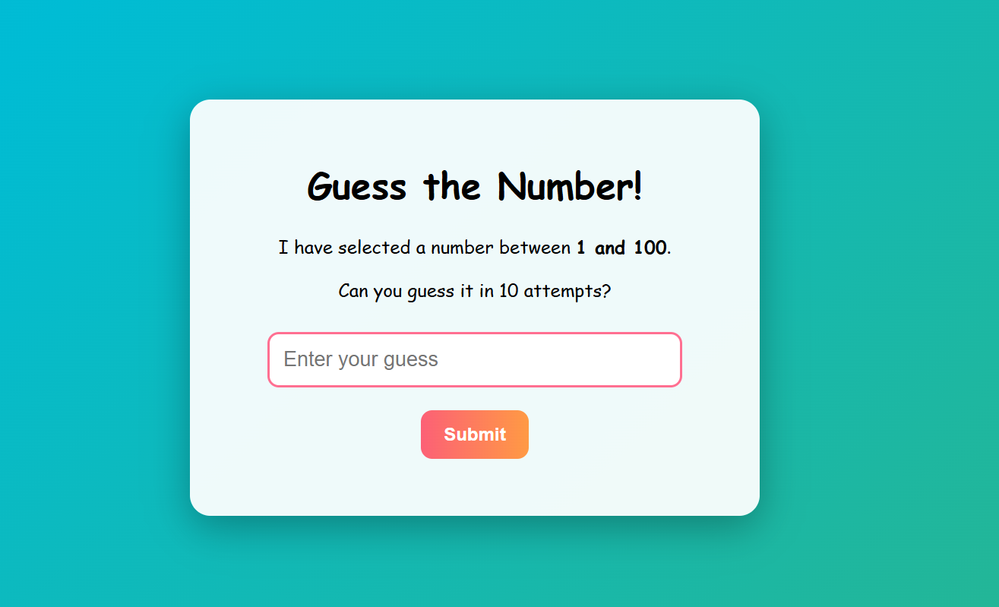
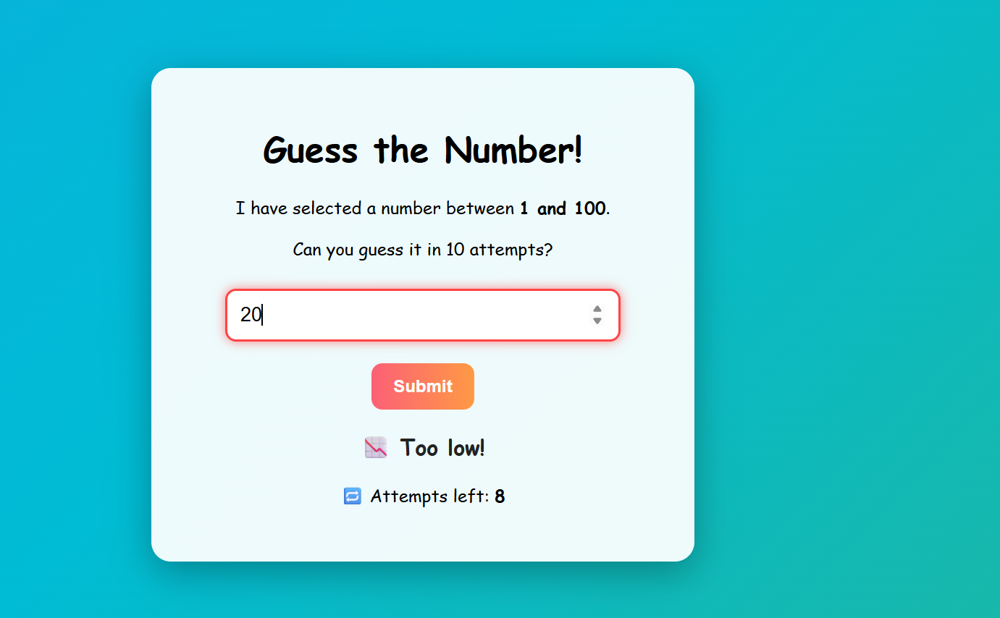
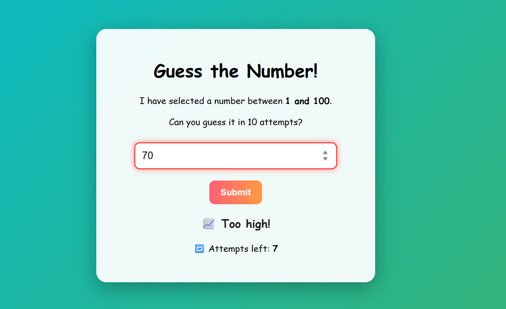
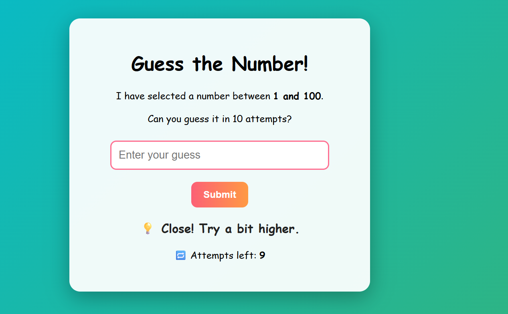
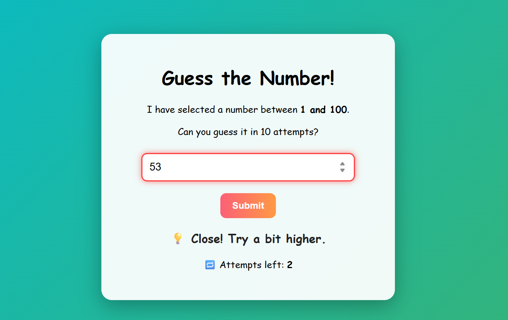
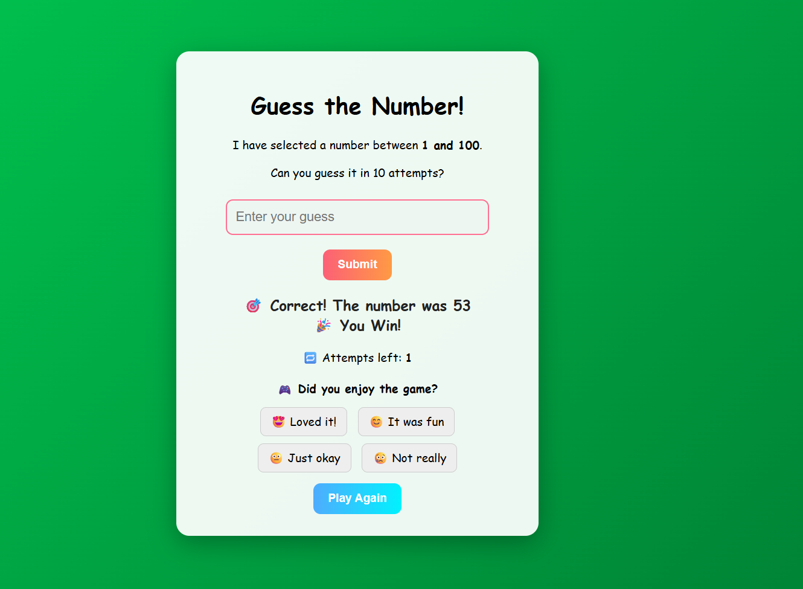
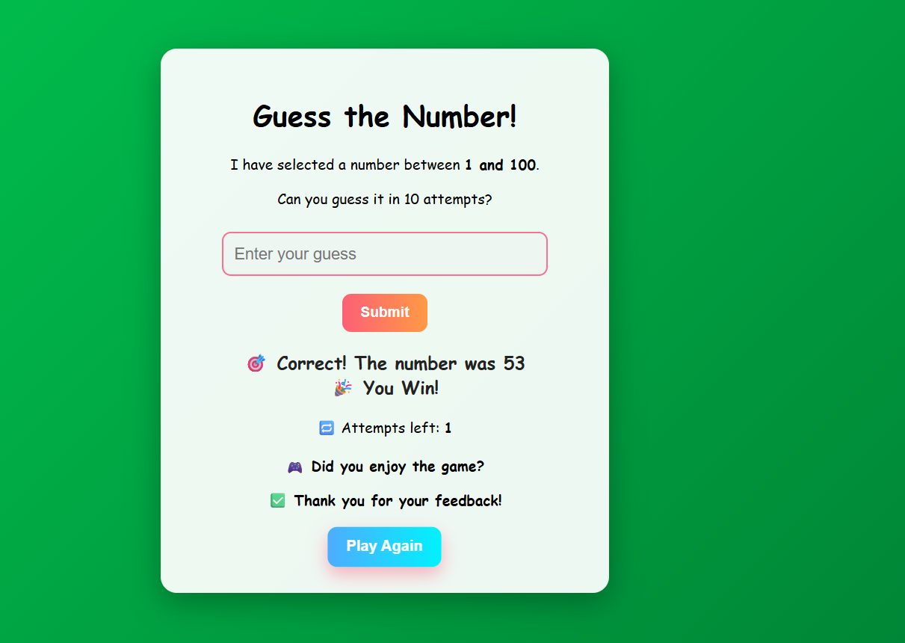

# 🎯 Guess the Random Number

A fun and interactive number guessing game built with **HTML, CSS, and JavaScript**.  
The player has **10 attempts** to guess a secret number between **1–100**.  
Instant feedback guides the player with hints like *too high*, *too low*, or *so close!*.  

##🚀 Live Demo
▶️ Play the game here: [Guess the Numb Game-Live](https://chaitanyasivathmika19.github.io/Guess-the-Numb-Game/)

---

## 🚀 Features
- 🔢 Random number generated each game  
- 🎮 10 attempts to guess correctly  
- 💡 Smart hints (too high, too low, close, very close)  
- 🎉 Winning and losing effects  
- 🔁 Reset button to restart the game  
- 📝 Feedback form after each game  

---

## 🛠️ Tech Stack
- **HTML** – structure  
- **CSS** – styling & effects  
- **JavaScript** – game logic  

---

## 📷 Preview

<p align="center">
  
  
  
</p>

<p align="center">
  
  
</p>

<p align="center">
  
  
</p>

 
---

## ▶️ How to Play
1. Enter a number between **1 and 100**.  
2. Click **Submit** to check your guess.  
3. Follow the hints to get closer to the secret number.  
4. Win by guessing correctly within 10 attempts!  
5. If you lose, you can try again with the **Play Again** button.  

---

## 📂 Project Setup
Clone this repo and open the project in a browser:
```bash
git clone https://github.com/your-username/guess-the-random-number.git
cd guess-the-random-number
